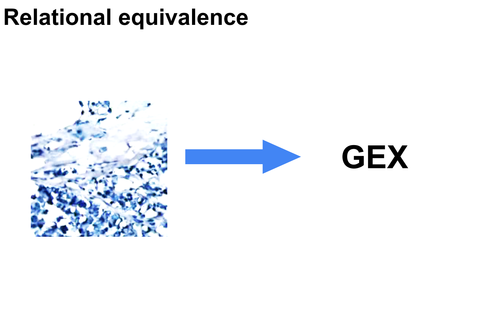
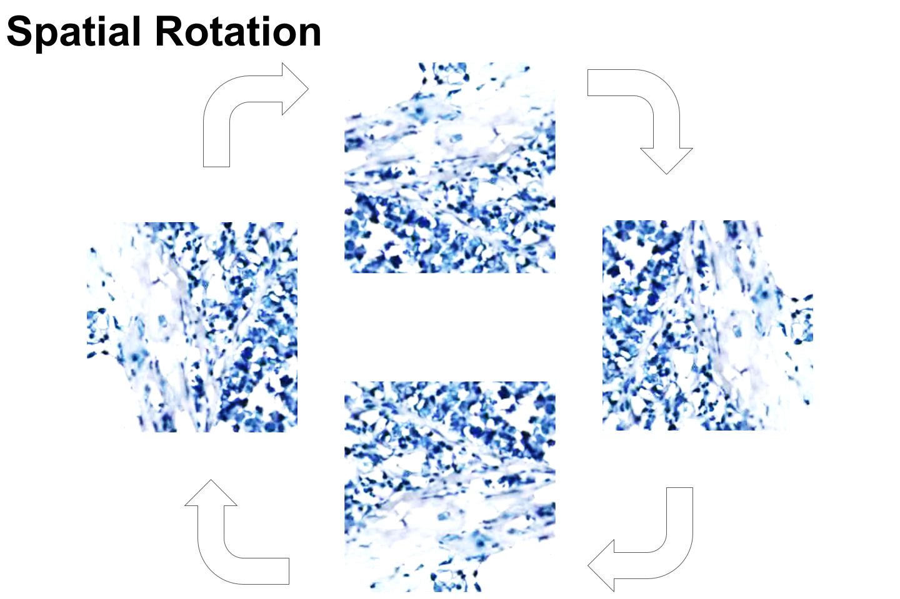
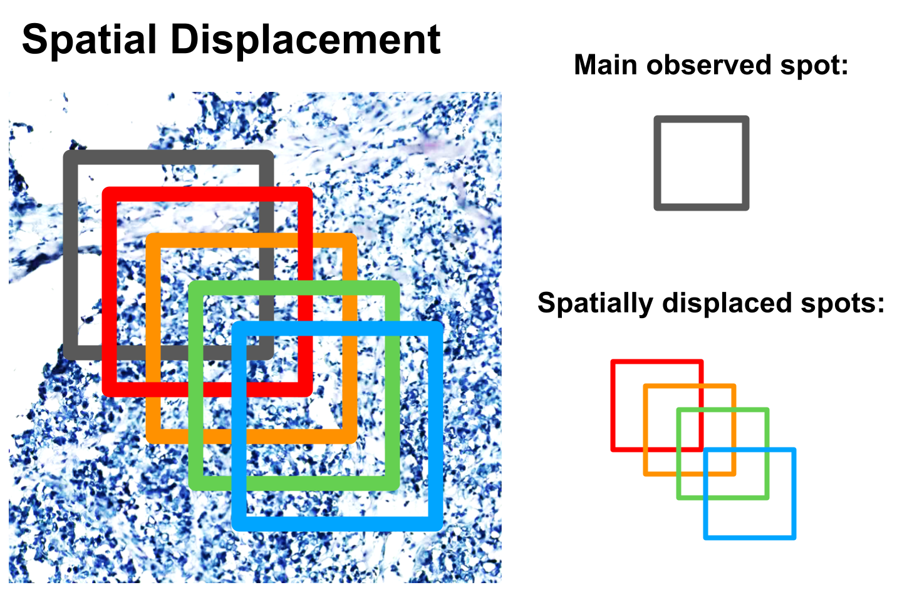
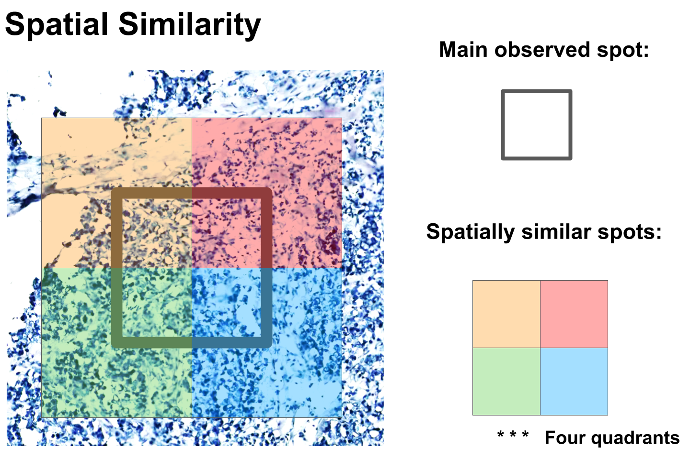
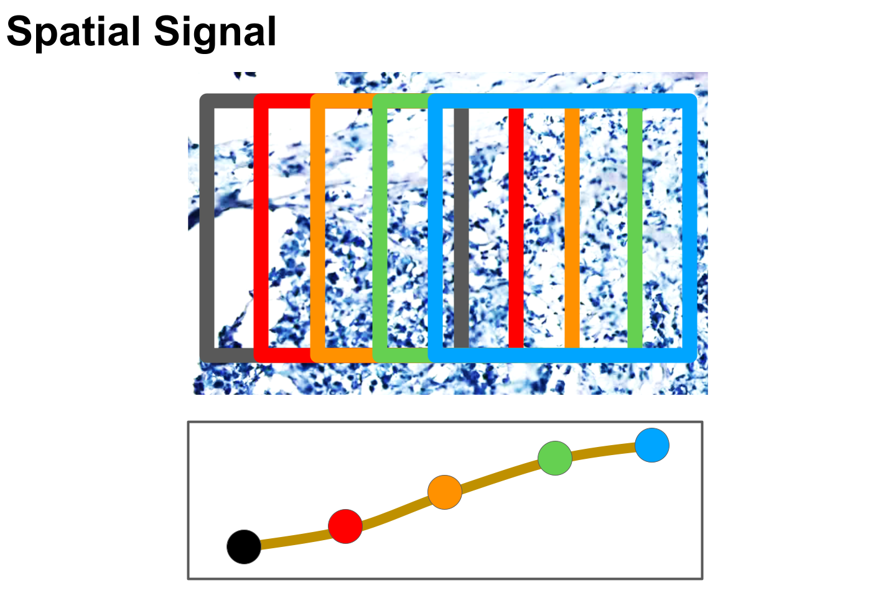

### GeneCodeR analysis of Spatial Transcriptomic data

Imaging tissue contains genes spatially organised by the extracellular matrix, individual cell types and groups of cell compartments. Using linear algebra and vectors, the expected patterns of the histology images are learned (example patterns of (1): extracellular matrix stained in eosin, and (2): nuclei of cells stained in hematoxylin). Assigning each sample image to a learned pattern (by the Generative Encoder algorithm) is similar to assigning an image weight to a pattern vector. Accordingly, genes are also assigned weights to the same set of expected image patterns. This encodes the information into the same space. 

The library that wraps around the Generative Encoder algorithm (gcode) is called GeneCodeR and provides a more comprehensive interface to load data from path, run gcode, extract relevant transformations, and validate the learned patterns.

```{r library, message=F}

# Main libraries for analysis
library(GeneCodeR)
library(gcode)

# Main libraries for plotting
library(ggplot2)
library(grid)
library(gridExtra)

```

Please replace these paths

```{r main_paths, eval=FALSE}

# Please replace these paths
path_to_save <- "~/Documents/main_files/AskExplain/GeneCoder/temp_save_dir/"
path_to_work <- "~/Documents/main_files/AskExplain/GeneCoder/temp_work_dir/"

```

Download data and format

```{r set_up_paths, eval=FALSE}

dir.create(path_to_save)
dir.create(path_to_work)

setwd(path_to_work)
curl::curl_download(url = "https://data.mendeley.com/api/datasets-v2/datasets/29ntw7sh4r/zip/download?version=5", destfile = paste(path_to_work,"he_et_al.zip",sep=""))
utils::unzip(zipfile = paste(path_to_work,"he_et_al.zip",sep=""), exdir = path_to_work)
path_to_work <- paste(path_to_work,"29ntw7sh4r-5",sep="")

setwd(path_to_work)

main_files <- list.files(path_to_work, full.names = T)
new_files <- gsub(pattern = "BC", replacement = "BT", x = main_files)
file.rename(from = main_files, to = new_files)

```

GeneCodeR takes in three input files from a generic Spatial Transcriptomic dataset, per tissue slide:

1 - coordinates
2 - gene expression 
3 - images

```{r generate_file_list_for_genecoder, eval=FALSE}

# Input list of files

file_path_list <- GeneCodeR::extract_path_framework(F)

file_path_list$coord$path <- list.files(path_to_work,pattern = ".csv.gz",full.names = T)
file_path_list$gex$path <- list.files(path_to_work,pattern = "stdata.tsv.gz",full.names = T)
file_path_list$pixel$path <- list.files(path_to_work,pattern = ".jpg",full.names = T)

```


```{r set_up_train_test, eval=FALSE}

set.seed(1)
train_ids <- sample(c(1:length(file_path_list$coord$path)),round(length(file_path_list$coord$path)*0.6,0))
test_ids <- c(1:length(file_path_list$coord$path))[-train_ids]

train_file_path_list <- lapply(file_path_list,function(X){
  list(path=X$path[train_ids])
})
test_file_path_list <- lapply(file_path_list,function(X){
  list(path=X$path[-train_ids])
})

```

The GeneCodeR configuration file takes in several parameters.

The first set of parameters is information to extract spots - such as spot size, and any augmentations such as displacement of the coordinates, or rotation of the image.

The second set of parameters is for after the gcode model is learned (via GeneCodeR wrapper). This is to transfrom from one modality, to another modality (for example, from image to gene expression).

```{r set_up_config_for_genecoder, eval=FALSE}

# Set up genecoder configuration parameters

genecoder.config <- GeneCodeR::extract_config_framework(F)

```

The meta information file takes in several parameters per coordinate, gene expression and image.

The first set of parameters is to read in the file. Here, example parameters such as the file type (for example, is it a .csv, .tsv, .jpg, .png, market matrix file (.mtx)?), and other important parameters based on file type (for example, does it contain a header, what is the separator ...).

Importantly, another set of parameters is the factor identifier in the coordinate file - which columns contain the x-coordinates, y-coordinates and the label identifier for the spots? For example, the label identifiers, are given by the rownames indicated by a 0.


```{r set_up_meta_info_for_genecoder, eval=FALSE}

# Set up meta information

meta_info_list <- GeneCodeR::extract_meta_framework(F)
meta_info_list$coord$read_file$file_type <- "csv"
meta_info_list$gex$read_file$file_type <- "tsv"
meta_info_list$pixel$read_file$file_type <- "image"

meta_info_list$coord$read_file$meta$header <- meta_info_list$gex$read_file$meta$header <- T
meta_info_list$coord$read_file$meta$sep <- ","
meta_info_list$gex$read_file$meta$sep <- "\t"
meta_info_list$coord$read_file$meta$quote <- meta_info_list$gex$read_file$meta$quote <- ""
meta_info_list$coord$read_file$meta$row.names <- 1
meta_info_list$gex$read_file$meta$row.names <- 1

meta_info_list$coord$factor_id$labels <- 0
meta_info_list$coord$factor_id$coord_x <- 1
meta_info_list$coord$factor_id$coord_y <- 2

```

To run the analysis appropriately, a set of common genes are required for all spots. 

```{r extract_common_gene_list, eval=FALSE}

common_genes <- lapply(c(1:length(file_path_list$gex$path)),function(X){
  print(X)
  colnames(GeneCodeR::read_file(path = file_path_list$gex$path[X], meta_info = meta_info_list$gex$read_file)[[1]])
})

meta_info_list$gex$factor$common_genes <- Reduce("intersect",common_genes)

```

Coordinate labels also need to be extracted.

```{r extract_coordinate_ids, eval=FALSE}

meta_info_list$coord$factor$labels <- lapply(c(1:length(train_file_path_list$coord$path)),function(X){
  row.names(GeneCodeR::read_file(path = train_file_path_list$coord$path[X], meta_info = meta_info_list$coord$read_file)[[1]])
})

```

Gene expression data is extracted using the path list, meta information, and configuration parameters.

```{r from_set_up_extract_gex, eval=FALSE}

# Extract gex data
gex_data <- GeneCodeR::prepare_gex(file_path_list = train_file_path_list,meta_info_list = meta_info_list,config = genecoder.config)

```

Importantly, labels for the meta information from the gene expression data extraction is required for extracting relevant spots that contain gene expression greater than background.

```{r from_set_up_extract_spots, eval=FALSE}

# Store meta data
meta_info_list$gex$factor$labels <- gex_data$labels

# Extract spot data
spot_data <- GeneCodeR::prepare_spot(file_path_list = train_file_path_list,meta_info_list = meta_info_list,config = genecoder.config)

```

Relevant frameworks are set up to begin learning the Generative Encoder model.

Firstly, set up the data list, which stores the gene expression and spot data.

```{r set_up_data_info_for_model_learning_gcode, eval=FALSE}

# Set up data

data_list <- list(gex=gex_data$gex,spot=spot_data$spot)

```

The join framework is set up, creating the model structure that learns (1): a similar function for "all" datasets, or (2): separate functions across gene expression and image pixel spots.

Here, only the incode and the beta parameters are set up to learn the individual patterns between genes and images. Given the samples are extracted from the same tissue site (image and genes at the same spot), the sample patterns are shared. The feature patterns and the sample patterns (see first paragraph - genes assigned to expected image patterns of hematoxylin and eosin stains) are mapped to a shared latent space via the alpha and beta codes. For example, the use of image patterns is analogous 
to pattern matching to the example image spot, the latent codes un-rotate any example image spots until it best fits the image pattern. 

```{r set_up_join_info_for_model_learning_gcode, eval=FALSE}

# Set up join information

join <- gcode::extract_join_framework(F)
join$complete$data_list <- c("gex","spot")
join$complete$alpha <- c("all","all")
join$complete$code <- c("all","all")
join$complete$alpha.code <- c("all","all")
join$complete$beta.code <- c("all","all")
join$complete$incode <- c("gex","spot")
join$complete$beta <- c("gex","spot")

```

Set up configuration information - the dimensions of the encoding space for the samples (i_dim), and the features (j_dim), as well as the dimensions of the latent code (k_dim) are set up. The initialisation for these parameters are set up via the irlba library using partial Singular Value Decomposition.

```{r set_up_config_for_model_learning_gcode, eval=FALSE}

# Set up gcode config

gcode.config <- gcode::extract_config(F)
gcode.config$init <- c("irlba","irlba")
gcode.config$k_dim <- 50
gcode.config$i_dim <- 100
gcode.config$j_dim <- 100

```

Run the Generative Encoder model

```{r run_gcode, eval=FALSE}

# Set up gcode model

genecoder.model <- GeneCodeR::learn_model(data_list = data_list, config = gcode.config, join = join)

```


Now begins the testing validation phase...

First extract the test set of the coordinate factor labels.

```{r prepare_test_coordinate_ids, eval=FALSE}

# Evaluate on test set

meta_info_list$coord$factor$labels <- lapply(c(1:length(test_file_path_list$coord$path)),function(X){
  row.names(GeneCodeR::read_file(path = test_file_path_list$coord$path[X], meta_info = meta_info_list$coord$read_file)[[1]])
})

```


Next extract the test set of the gene expression data.

```{r prepare_test_gex_data, eval=FALSE}

# Extract test gex data
test_gex_data <- GeneCodeR::prepare_gex(file_path_list = test_file_path_list,meta_info_list = meta_info_list,config = genecoder.config)
meta_info_list$gex$factor$labels <- test_gex_data$labels

```


Save relevant information, including the model, the test meta information, and the test gene expression data.

```{r save_important_files_for_validation, eval=FALSE}

save(genecoder.model,file = paste(sep="",path_to_save,"genecoder.RData"))
save(test_gex_data,file = paste(sep="",path_to_save,"test_gex.RData"))
save(meta_info_list,file = paste(sep="",path_to_save,"meta_info_list.RData"))
save(test_file_path_list,file = paste(sep="",path_to_save,"test_file_path_list.RData"))

```


Remove all files to clean up space for validation

```{r remove_all_files}

rm(list=ls());gc()

# Restore paths
path_to_save <- "~/Documents/main_files/AskExplain/GeneCoder/temp_save_dir/"
path_to_work <- "~/Documents/main_files/AskExplain/GeneCoder/temp_work_dir/"

```


Reload important files recently saved:

1 - model learned
2 - test gene expression data
3 - test meta information 

```{r reload_important_files}

load(paste(sep="",path_to_save,"genecoder.RData"))
load(paste(sep="",path_to_save,"test_gex.RData"))
load(paste(sep="",path_to_save,"meta_info_list.RData"))
load(paste(sep="",path_to_save,"test_file_path_list.RData"))

```

Set up the test configuration for GeneCodeR

```{r set_up_test_config_for_validation}

# Set up genecoder transform information
genecoder.config <- GeneCodeR::extract_config_framework(F)
genecoder.config$transform$from <- "spot"
genecoder.config$transform$to <- "gex"

```


Set up validation functions to evaluate statistically significant differences via a t-test, and, cosine similarity.

```{r set_up_test_functions_for_validation}

# Testing functions

# t.test for difference between observations

t.test_difference_obs <- function(true_obs,a,b){
  t.test(c(a - true_obs),c(b - true_obs))
}

# cosine metric for similarity between observations

cosine.simil_sample_and_genes <- function(a,b){
  
return(
  list(
    
    sample_wise = do.call('c',parallel::mclapply(c(1:dim(a)[1]),function(X){
      
      lsa::cosine(a[X,],b[X,])
      
    },mc.cores = 8)),
    
    gene_wise = do.call('c',parallel::mclapply(c(1:dim(a)[2]),function(X){
      
      lsa::cosine(a[,X],b[,X])
      
    },mc.cores = 8))
    
  )
)
  
}

```


Base validation is used to directly compare observed gene expression with transformed image spots representing gene expression via pattern matching and weight assignment. Cosine similarity is used to compare the observed and the transformed.



```{r base_validation, eval=FALSE}

# Base testing

# Extract test spot data

base_test_spot_data <- GeneCodeR::prepare_spot(file_path_list = test_file_path_list,meta_info_list = meta_info_list,config = genecoder.config)

base_spot2gex <- GeneCodeR::genecoder(model=genecoder.model, x = base_test_spot_data$spot, config = genecoder.config)

base_spot2gex <- cosine.simil_sample_and_genes(a = test_gex_data$gex, base_spot2gex)

save(base_spot2gex,file = paste(sep="",path_to_save,"base_spot2gex.RData"))

```


```{r plot_base}
load(file = paste(sep="",path_to_save,"base_spot2gex.RData"))

title_name = "base_cosine_similarity"
tissue_name = "breast"

sample_similarity = base_spot2gex$sample_wise
feature_similarity = base_spot2gex$gene_wise

library(ggplot2)

lm <- rbind(c(1,2),
            c(1,2),
            c(1,2))

g1 <- ggplot(data.frame(Measure=sample_similarity,Metric="Predicted vs Observed \n Sample-wise Pearson Correlation"), aes(x=Metric,y=Measure)) + 
  geom_violin() + ylim(-1,1) 

g2 <- ggplot(data.frame(Measure=feature_similarity,Metric="Predicted vs Observed \n Gene-wise Pearson Correlation"), aes(x=Metric,y=Measure)) + 
  geom_violin() + ylim(-1,1) 

gg_plots <- list(g1,g2)

library(grid)
library(gridExtra)
final_plots <- arrangeGrob(
  grobs = gg_plots,
  layout_matrix = lm
)

plot(final_plots)

ggsave(final_plots,filename = paste(path_to_save,"/jpeg_accuracy_gcode_",tissue_name,"_SPATIAL/",title_name,"_accuracy_",tissue_name,"_spatial.png",sep=""),width = 5,height=5)

```


Rotation testing is used to evaluate how rotated images affect the differences between the rotated image transformed to gene expression and the observed gene expression. It is expected that regardless of rotation, the gene expression should not be statistically significantly different across rotated images transformed to gene expression.




```{r rotation_validation, eval=FALSE}

# Spatial rotation testing

rotate_spot2gex <- list()
for (rotate_val in c(0,90,180,270)){
  genecoder.config$extract_spots$rotation <- rotate_val

  rotate_test_spot_data <- GeneCodeR::prepare_spot(file_path_list = test_file_path_list,meta_info_list = meta_info_list,config = genecoder.config)

  rotate_spot2gex[[as.character(rotate_val)]] <- GeneCodeR::genecoder(model=genecoder.model, x = rotate_test_spot_data$spot, config = genecoder.config)
}


rotate_spot2gex <- lapply(c(2:4),function(X){
  t.test_difference_obs(true_obs = test_gex_data$gex, a = rotate_spot2gex[[1]], b = rotate_spot2gex[[X]])
})

save(rotate_spot2gex,file = paste(sep="",path_to_save,"rotate_spot2gex.RData"))


```


```{r plot_rotation}

load(file = paste(sep="",path_to_save,"rotate_spot2gex.RData"))

print(c("rotate p-value",paste(c("0vs90:    ","0vs180:    ","0vs270:    "),round(do.call('c',lapply(rotate_spot2gex,function(X){X$p.value})),5))))

```

Displacement testing is used to evaluate how gene levels change when the image spot is displaced from where gene expression is experimentally measured. It is expected that as the displacement increases, the gene expression difference should become more statistically significantly different.



```{r displacement_validation, eval = FALSE}

# Spatial displacement testing

displace_spot2gex <- list()
for (displace_val in c(0,2,4,8)){
  genecoder.config$extract_spots$rotation <- 0
  genecoder.config$extract_spots$displacement_x <- displace_val
  genecoder.config$extract_spots$displacement_y <- displace_val

  displace_test_spot_data <- GeneCodeR::prepare_spot(file_path_list = test_file_path_list,meta_info_list = meta_info_list,config = genecoder.config)

  displace_spot2gex[[as.character(displace_val)]] <- GeneCodeR::genecoder(model=genecoder.model, x = displace_test_spot_data$spot, config = genecoder.config)
}

displace_spot2gex <- lapply(c(2:4),function(X){
  t.test_difference_obs(true_obs = test_gex_data$gex, a = displace_spot2gex[[1]], b = displace_spot2gex[[X]])
})

save(displace_spot2gex,file = paste(sep="",path_to_save,"displace_spot2gex.RData"))

```


```{r plot_displacement}

load(file = paste(sep="",path_to_save,"displace_spot2gex.RData"))

print(c("displace p-value",paste(c("0vs2:    ","0vs4:    ","0vs8:    "),round(do.call('c',lapply(displace_spot2gex,function(X){X$p.value})),5))))

```


Similarity testing is used to evaluate how similar displaced image spots are to the experimentally observed spot (for example, when both images overlap). It is expected that similar spots should not be statistically significantly different in gene expression levels. 



```{r similarity_validation, eval=FALSE}

# Spatial similarity testing

similar_spot2gex <- list()
for (i in c(1,2,3,4)){

  if (i==1){
    similar_val.x = -3
    similar_val.y = -3
  }
  if (i==2){
    similar_val.x = 3
    similar_val.y = -3
  }
  if (i==3){
    similar_val.x = -3
    similar_val.y = 3
  }
  if (i==4){
    similar_val.x = 3
    similar_val.y = 3
  }

  genecoder.config$extract_spots$displacement_x <- similar_val.x
  genecoder.config$extract_spots$displacement_y <- similar_val.y

  similar_test_spot_data <- GeneCodeR::prepare_spot(file_path_list = test_file_path_list,meta_info_list = meta_info_list,config = genecoder.config)

  similar_spot2gex[[as.character(i)]] <- GeneCodeR::genecoder(model=genecoder.model, x = similar_test_spot_data$spot, config = genecoder.config)
}


similar_spot2gex <- lapply(c(2:4),function(X){
  t.test_difference_obs(true_obs = test_gex_data$gex, a = similar_spot2gex[[1]], b = similar_spot2gex[[X]])
})

save(similar_spot2gex,file = paste(sep="",path_to_save,"similar_spot2gex.RData"))

```


```{r plot_similarity}

load(file = paste(sep="",path_to_save,"similar_spot2gex.RData"))

print(c("similar p-value",paste(c("0,0vs(-)3,(-)3:    ","0,0vs3,(-)3:    ","0,0vs(-)3,3:    ","0,0vs3,3:    "),round(do.call('c',lapply(similar_spot2gex,function(X){X$p.value})),5))))

```


Signal testing is used to evaluate how gene expression signals change over a spatial region when the example image spot slides over a spatial region. It is expected that the gene expression should represent a signal, such that a smoothing model can be learned with a reasonable and flexible fit.


```{r signal_validation, eval = FALSE}

# Spatial signal testing

signal_spot2gex <- list()
for (i in c(1:10)){

  genecoder.config$extract_spots$displacement_x <- i
  genecoder.config$extract_spots$displacement_y <- 0

  signal_test_spot_data <- GeneCodeR::prepare_spot(file_path_list = test_file_path_list,meta_info_list = meta_info_list,config = genecoder.config)

  signal_spot2gex[[as.character(i)]] <- GeneCodeR::genecoder(model=genecoder.model, x = signal_test_spot_data$spot, config = genecoder.config)
}

save(signal_spot2gex,file = paste(sep="",path_to_save,"signal_spot2gex.RData"))


number_of_top_variable_genes_to_extract_adj.r.squared <- 3

spline_signal_adj.r.squared <- do.call('rbind',lapply(c(order(apply(test_gex_data$gex,2,var),decreasing = T)[1:number_of_top_variable_genes_to_extract_adj.r.squared]),function(Y){
  internal.adj.r2 <- do.call('c',pbmcapply::pbmclapply(c(1:dim(signal_spot2gex[[1]])[1]),function(Z){
    signal_spline <- data.frame(gene_level = do.call('c',lapply(c(1:10),function(X){
      signal_spot2gex[[X]][Z,Y]
    })),displacement=c(1:10))
    adj.r.squared <- try(npreg::summary.ss(npreg::ss(x = signal_spline$gene_level,y = signal_spline$displacement))$adj.r.squared,silent = F)
    if (!is.character(signal_spline)){
      return(as.numeric(adj.r.squared))
    }
  },mc.cores = 8))
}))

save(spline_signal_adj.r.squared,file = paste(sep="",path_to_save,"spline_signal_adj.r.squared.RData"))

```


```{r plot_signal_1}

load(file = paste(sep="",path_to_save,"signal_spot2gex.RData"))

  
signal_spline <- data.frame(gene_level = do.call('c',lapply(c(1:10),function(X){
  signal_spot2gex[[X]][1,1]
})),displacement=c(1:10))

mod.ss <- npreg::summary.ss(npreg::ss(x = signal_spline$gene_level,y = signal_spline$displacement))

plot(signal_spline$gene_level ~ signal_spline$displacement, main = paste("Adj.R-squared:    ",mod.ss$adj.r.squared))
lines(signal_spline$gene_level, mod.ss$y, lty = 2, col = 2, lwd = 2)

```


```{r plot_signal_2}

load(file = paste(sep="",path_to_save,"spline_signal_adj.r.squared.RData"))

title_name = "spatial_signal"
tissue_name = "breast"

first_most_variable_gene = spline_signal_adj.r.squared[1,]
second_most_variable_gene = spline_signal_adj.r.squared[2,]
third_most_variable_gene = spline_signal_adj.r.squared[3,]

library(ggplot2)

lm <- rbind(c(1,2,3),
            c(1,2,3),
            c(1,2,3))

g1 <- ggplot(data.frame(Measure=first_most_variable_gene,Metric="Adj.R.Squared of Spline fits \n 1st most variable gene \n across all spatial spots"), aes(x=Metric,y=Measure)) + 
  geom_violin() + ylim(-1,1) 

g2 <- ggplot(data.frame(Measure=second_most_variable_gene,Metric="Adj.R.Squared of Spline fits \n 2nd most variable gene \n across all spatial spots"), aes(x=Metric,y=Measure)) + 
  geom_violin() + ylim(-1,1) 

g3 <- ggplot(data.frame(Measure=third_most_variable_gene,Metric="Adj.R.Squared of Spline fits \n 3rd most variable gene \n across all spatial spots"), aes(x=Metric,y=Measure)) + 
  geom_violin() + ylim(-1,1) 

gg_plots <- list(g1,g2,g3)

final_plots <- arrangeGrob(
  grobs = gg_plots,
  layout_matrix = lm
)

plot(final_plots)

ggsave(final_plots,filename = paste(path_to_save,"/jpeg_accuracy_gcode_",tissue_name,"_SPATIAL/",title_name,"_accuracy_",tissue_name,"_spatial.png",sep=""),width = 7,height=5)


```

Together, given the results are consistent with the expected output based on a reasonable, flexible and appropriate model that learns relevant information - GeneCodeR based on wrapping Generative Encoders, can be considered an acceptable model for image analysis. Transformational perturbations between gene expression and images, as well as, other modalities based on current and future technologies is an exciting development for spatial biology.

